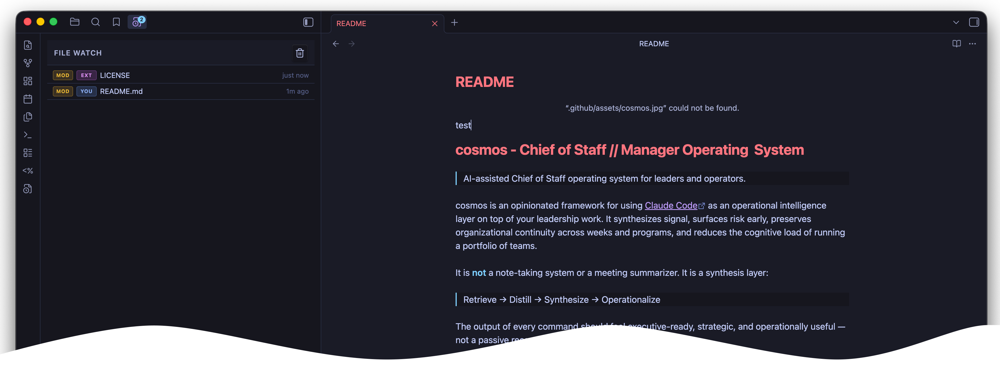

# FileWatch — Obsidian Plugin

A sidebar panel that tracks **which files were created or modified** in your vault — including changes made by external tools like Claude running in your terminal.



---

## Features

- **Live sidebar panel** — lists every created/modified file, newest first
- **Source detection** — distinguishes changes made *by you* (Obsidian active) vs *externally* (Claude, scripts, git) using a window-focus heuristic
- **Kind badges** — green **NEW** for created files, amber **MOD** for modified files
- **Source badges** — **YOU** for local changes, **EXT** for external/remote changes (labels and colors are customizable)
- **File explorer dots** — a small colored dot appears next to changed files (and their parent folders) directly in the Files panel; opening a file clears its dot
- **Appearance customization** — set your own colors for the "you" and "external" roles, adjust dot size, and rename the badge labels; changes apply instantly
- **Tab badge** — unseen-count bubble appears on the sidebar tab when new changes arrive while you're elsewhere
- **Tab pulse** — the tab flashes when a change is detected (can be disabled)
- **Click to open** — click any file name to open it in the editor
- **Clear button** — wipe the list when you're done reviewing
- **Persistent** — list survives Obsidian restarts (stored in plugin data)

---

## Installation

1. Download `main.js`, `manifest.json`, and `styles.css` from the latest release
2. Copy them into your vault at `.obsidian/plugins/filewatch/`
3. In Obsidian, go to **Settings → Community plugins**
4. Disable Safe Mode if prompted
5. Enable **File Watch**

---

## For developers

### Build from source

```bash
git clone https://github.com/pauldenni/filewatch
cd filewatch
npm install
npm run build
```

Copy the output (`main.js`, `manifest.json`, `styles.css`) into your vault's `.obsidian/plugins/filewatch/` folder, then enable the plugin as above.

### Dev mode (hot-reload)

```bash
npm run dev
```

This watches `main.ts` for changes and rebuilds automatically.

---

## Settings

| Setting | Description | Default |
|---|---|---|
| **Track changes from** | All / External only / Local only | All |
| **Max entries** | How many events to keep | 50 |
| **Show timestamps** | Display relative time next to each entry | On |
| **Highlight tab on change** | Flash the tab on new changes (badge always shows regardless) | On |
| **Remote detection window (ms)** | How long after the window loses focus before changes count as "external" | 2000 |
| **Persist history across restarts** | Restore the event list when Obsidian reopens | On |
| **Show dots in Files panel** | Display colored dots next to changed files and folders in the Files panel | Off |
| **"You" label** | Text on the badge for your own changes | YOU |
| **"You" color** | Color for your own change badges and explorer dots | Blue |
| **"External" label** | Text on the badge for externally-made changes | EXT |
| **"External" color** | Color for external change badges and explorer dots | Purple |
| **Explorer dot size** | Diameter of the indicator dots in the Files panel (4–12 px) | 6 |
| **Reset appearance to defaults** | Restore default colors, dot size, and labels | — |

---

## How remote detection works

Obsidian's vault API fires `modify`/`create` events for **all** file changes, regardless of source — there's no native way to tell whether a change came from inside Obsidian or from an external process.

File Watch uses a **window-focus heuristic**:

- If the Obsidian window is **currently active** → change is marked **YOU (local)**
- If Obsidian lost focus **within the last N ms** (configurable, default 2s) → still marked **YOU (local)** (grace period)
- If Obsidian has been **in the background** longer than that → change is marked **EXT (external)**

This works well for the Claude use case: you run a command in your terminal (Obsidian loses focus), Claude writes files, and those show up as **EXT**. When you then click back into Obsidian and save a note yourself, it shows up as **YOU**.

It's a heuristic, not perfect — if an external tool creates a file within 2 seconds of you switching away from Obsidian, it may be marked as local.

---

## File structure

```
filewatch/
├── main.ts              ← Source (TypeScript)
├── main.js              ← Compiled plugin (committed for easy install)
├── styles.css           ← Sidebar panel styles
├── manifest.json        ← Plugin metadata
├── package.json
├── esbuild.config.mjs
└── tsconfig.json
```
